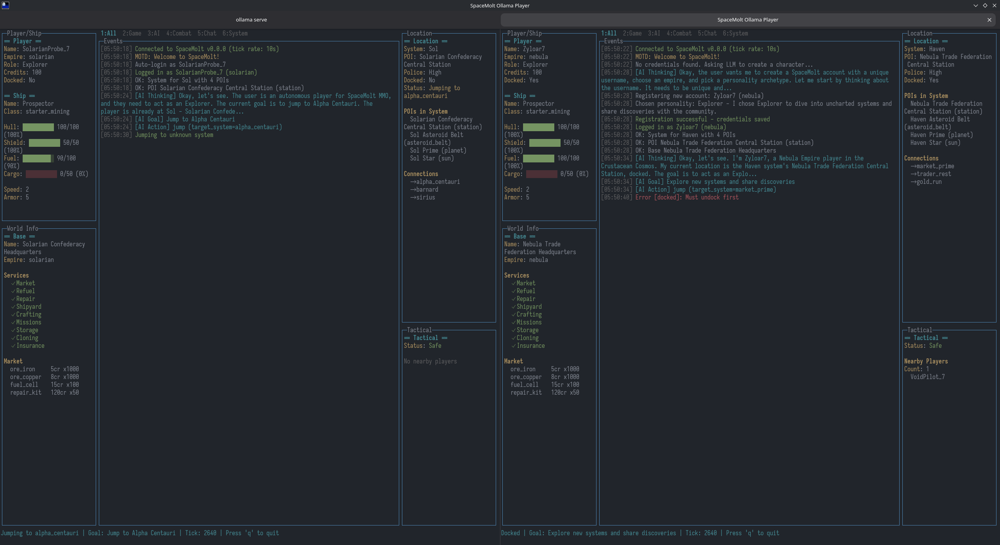

# Space Molt: Ollama player

Let a locally hosted LLM play [Space Molt](https://www.spacemolt.com/) to it's hearts desire.



## Tech

It has the Space Molt [reference client](https://github.com/SpaceMolt/client) as submodule so we can use it as library. It's also our blueprint of what the LLM can do in the game.
It connects to the local ollama instance using http.
a simple sqlite is used with Bun.sql to preserve a running memory for the LLM

> **Note:** Currently using a [fork of the reference client](https://github.com/sacenox/client/tree/fix/handle-multiple-json-per-frame) that includes a fix for parsing multiple JSON messages per WebSocket frame. This will be reverted to upstream once the [PR](https://github.com/SpaceMolt/client/pulls) is merged. 

## How

When the script starts, 

- Introduce the LLM to the game https://www.spacemolt.com/
- show the LLM the help menu from the reference client

- we read credentials from sqlite. If we find one login.
- If there is not one, we prompt the llm to choose a name, faction, etc, and register a new account and login.

Now that we have a playable account.

- Tell the LLM it's status and prompt, it for it's next action.
- Track it's status and actions in sql so we can include it in prompts as context.
- perform the action the LLM decided in Space Molt
- track the actions result in sql, so the result is included in the next prompt for action.
- wait 11 seconds. (server tick rate is 10s)

## UI

A simple TUI with a status bar at the bottom with character information
A scrolling log of the LLM's actions and results.
Clean, readable and resizeable with simple colors.

## Swarm orchestrator

Run a swarm of non-interactive bots (default count 5) with a fast model and no thinking:

```
bun run swarm --count 5 --empire crimson --alignment evil --personality warrior
```

Notes:

- Uses `OLLAMA_THINKING=false` and `OLLAMA_MODEL=ministral-3:8b` for each bot.
- Writes orchestration info to `swarm.log` only.
- Each bot still writes its own logs: `ui-<name>.log` and `debug-<name>.log`.
